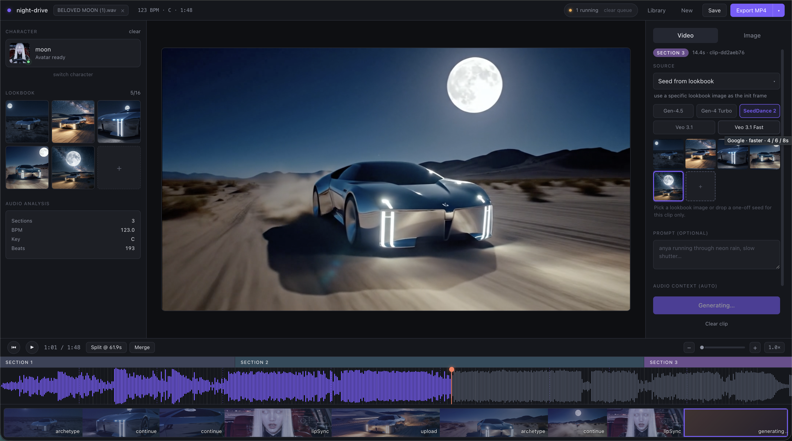

# Music Video Studio

> Audio-aware AI timeline editor for music videos. Drop in a song, get a beat-aware timeline of clips, fill each one with AI-generated video, and render to MP4.

https://github.com/user-attachments/assets/94b6d14f-810e-4a53-9af6-22135417e87c

*Music in the demo: "HEY MOON" by [ANIMUSCULT](https://open.spotify.com/album/0qT88s29ZYPSsnXdSFzGxI?si=CYHK5WwoREeWhQKW1sfVOA).*



*Night-drive project: audio-analysis panel on the left, lookbook above it, section-labeled timeline below, mid-generation state visible.*


*A different project mid-edit: the **AUDIO CONTEXT** panel auto-feeds section / energy / duration into every generation, and **Bridge between neighbors** interpolates from the previous clip's last frame to the next's first frame for seamless cuts.*

## What it does

Upload a track → audio analyzer extracts BPM / beats / sections / energy → the timeline auto-subdivides into clips snapped to detected boundaries → for each clip you pick a generation source (continue, lookbook seed, fresh text-to-image, text-to-video, lip-sync, video-restyle) and a model, then click Generate → ffmpeg stitches the finished clips into an MP4 against the original audio.

## Repo Layout

| Path | What |
|---|---|
| `apps/web` | React 19 + Vite SPA — timeline, waveform, sidebar, preview |
| `apps/api` | Fastify API — generation, render, storage, library |
| `packages/shared` | Zod schemas + TS types shared across web and api |
| `modal/` | Python audio analysis (librosa) — see [modal/README.md](modal/README.md) |
| `infra/` | Terragrunt + Terraform for AWS deploy — see [infra/README.md](infra/README.md) |
| `wireframes/` | Initial design exploration |

## Features & Updates

### 1. Robust Audio Analyzer & Built-in Procedural Fallback (New!)
- **Upload Formats**: Upload mp3 / wav / flac / ogg / m4a, validated by magic-byte sniff (MIME headers can lie).
- **Three-Tier Analysis Pipeline**:
  1. **Local CLI (Python/Librosa)**: Attempts fast local analysis using a python script.
  2. **Remote Sidecar (Modal)**: Polls a remote python container with CPU/librosa.
  3. **Procedural Analysis Fallback**: If the local CLI is missing dependencies and the remote Modal backend is offline or returns a 500 error, a highly-optimized procedural generator is triggered. It uses `ffprobe` to determine the exact duration, and procedurally models:
     - 120 BPM tempo grid
     - Section subdivisions aligned to 8/16-bar downbeat phrases (e.g. 16.0s or 32.0s blocks)
     - Standard 4/4 downbeats and beat timestamps
     - A beautiful, wave-like normalized RMS amplitude curve
- **No Upload Failures**: This fallback guarantees 100% reliable song uploads. No "500 Internal Server Error" or "analysis failed" errors ever crash your workflow.

### 2. Streamlined AI Video Generation Models
The application is fully synchronized to use five active flagship models:
- **Gen-4.5** (flagship · 2–10s)
- **Gen-4 Turbo** (fast · 5 / 10s)
- **SeedDance 2** (high quality · 5–15s)
- **Veo 3.1** (Google · 4 / 6 / 8s)
- **Veo 3.1 Fast** (Google · faster · 4 / 6 / 8s)

*Per-model durations are automatically snapped to acceptable boundaries for each backend API.*

### 3. Generation Sources (Per Clip)
- **Continue from previous clip** — extracts the last frame of the prior generated video and uses it as the init image. Defaults whenever a previous clip is ready.
- **Seed from lookbook** — pick a specific lookbook image (or drop a one-off seed) as the init frame.
- **Generate fresh image** — text-to-image first, then image-to-video. Lookbook flows through as `references` for style consistency. Separate image-prompt and motion-prompt fields.
- **Text-to-video** — prompt → video in one Runway task, no seed image.
- **Character sings this section** (Lip-sync) — slices the song region, isolates vocals, drives the avatar's lip motion.
- **Restyle existing clip** (Aleph) — video-to-video transformation of an already-generated clip.

### 4. Cast & Style Lookbook
- **Avatars**: Upload a character image, then create a Runway avatar from it (personality + voice preset).
- **Lookbook Reference Engine**: Manage up to 16 reference images. Upload your own or use the built-in image generator (with support for Gen-4 Image, Imagen 3 Pro, Gemini Flash, etc.) to expand your palette.
- **Coherent Aesthetics**: Generated images auto-save to the library and can be loaded as reference inputs for style synchronization across the entire project.

### 5. Timeline & Double-Buffered Preview
- **Waveform View**: Powered by WaveSurfer.js with layout-accurate lanes for sections, subtitles, and clips.
- **Precision Cuts**: Split (`S`) and merge-right (`M`) controls snapped directly to downbeats.
- **Double-Buffered Playback**: Two `<video>` players swap back-and-forth dynamically, pre-buffering subsequent clips to eliminate black flashes on cuts.
- **Export Renderer**: Compiles the final timeline using a multi-stream ffmpeg graph overlaid on the original audio track. Supports optional 150ms alpha fades at cuts.

---

## Technical Stack

- **Frontend**: React 19 + Vite + React Router v7 (SPA mode) + WaveSurfer.js + Zustand + Tailwind CSS
- **Backend**: Fastify (Node.js) + TypeScript + Zod + `@runwayml/sdk` + `@fal-ai/client` + `ffmpeg` / `ffprobe`
- **Shared Code**: Monorepo package containing unified validation schemas, model parameters, and TS typings.

---

## Step-by-Step Configuration & Deployment Manual

### Introduction to Deployment & Render
If you are new to deploying web applications, don't worry! This guide is written specifically for beginners. 

* **What is "Deployment"?**  
  In local development, your application runs only on your computer (`localhost`). "Deploying" means copying your code to a professional, cloud-hosted computer (a server) that stays online 24/7 so that anyone in the world can access it via a public link (like `https://your-app.onrender.com`).
* **What is "Render"?**  
  Render is a modern cloud hosting platform that connects directly to your GitHub repository. Whenever you update your code and push it to GitHub, Render automatically downloads your changes, builds your app, and makes the new version live.

---

### Scenario A: Quick Local Setup (Free Mock Mode — No API Keys Needed)
*Perfect for testing the timeline, editing tools, and uploading songs without spending any money or setting up API accounts.*

1. **Clone the Code**: Download or clone this repository to your computer.
2. **Install Node.js & Dependencies**:
   * Make sure you have **Node.js** installed (v20 or v22 is recommended).
   * Open your terminal in the repository root folder and run:
     ```bash
     npm install
     ```
3. **Copy the Environment Template**:
   * Create a `.env` file by copying the example template:
     ```bash
     cp .env.example .env
     ```
   * *(You can leave all API keys blank! The app detects missing keys and automatically switches to **Mock Mode**).*
4. **Start the Development Server**:
   * Run the following command:
     ```bash
     npm run dev
     ```
   * Open **`http://localhost:3000`** in your browser.
5. **How to test Mock Mode**:
   * Upload any MP3/WAV file. The app will trigger the **Procedural Analysis Fallback**, simulating a 120 BPM beatgrid with clean downbeat phrasing.
   * Pick some sections, choose any video model, and click **Generate**. The app will quickly create procedural abstract colored video clips with custom layout previews so you can test timeline splits, drags, and video-stitching with zero delay or cost!

---

### Scenario B: Fully Powered Local Setup (Real AI Generation)
*To generate actual high-fidelity AI images, videos, lip-syncs, and lookbook characters.*

1. **Get your API Keys**:
   * **Fal.ai API Key**: Sign up at [fal.ai](https://fal.ai), add a few dollars of credit, and go to your dashboard to generate an API key.
   * **OpenRouter API Key**: Sign up at [openrouter.ai](https://openrouter.ai) to get access to advanced LLMs like Gemini Flash.
2. **Configure your `.env` File**:
   * Open `.env` in the repository root and paste your keys:
     ```env
     FAL_API_SECRET=your_actual_fal_api_key_here
     OPENROUTER_API_KEY=your_actual_openrouter_api_key_here
     OPENROUTER_MODEL=openrouter/free
     ```
3. **Start the Server**:
   * Run `npm run dev` and open `http://localhost:3000`.
   * Now when you click **Generate**, the app will connect to real state-of-the-art models (Runway Gen-4.5, Flux, Imagen, etc.) to produce genuine video and image assets!

---

### Scenario C: Production Deployment on Render (Docker Method — RECOMMENDED & EASIEST)
We **highly recommend** using Docker to deploy on Render. This application relies on **FFmpeg** to stitch videos and audio together. If you deploy using standard Node.js, you have to worry about manually installing FFmpeg binaries. With Docker, the pre-configured environment in `/apps/api/Dockerfile` automatically installs FFmpeg and sets up everything perfectly for you!

#### Step 1: Push Your Code to GitHub
Create a private or public repository on GitHub and push your code there.

#### Step 2: Create a New Web Service on Render
1. Go to [render.com](https://render.com) and log into your dashboard.
2. Click the **New +** button in the top right and select **Web Service**.
3. Select **Connect repository** and connect the GitHub repository you just created.

#### Step 3: Configure Settings
Fill out the creation form with these exact settings:
* **Name**: Choose a name (e.g., `music-video-studio`).
* **Region**: Select the region closest to you (e.g., `Oregon (US West)`).
* **Branch**: `main` (or whichever branch holds your code).
* **Runtime**: Select **Docker** (very important!).
* **Dockerfile Path**: Set this to `apps/api/Dockerfile`
* **Docker Build Context**: Leave as `.` (the root folder).
* **Instance Type**: Select **Free** (or a paid tier like Starter for faster builds).

#### Step 4: Configure Environment Variables
Scroll down and click **Advanced**, then **Add Environment Variable**. Add the following:
1. `PORT` = `3001` (This matches the port exposed by our Dockerfile).
2. `FAL_API_SECRET` = *(Your real Fal.ai secret)*
3. `OPENROUTER_API_KEY` = *(Your real OpenRouter key)*
4. `PUBLIC_BASE_URL` = *(Your service's onrender URL — e.g. `https://your-app-name.onrender.com`)*
5. `WEB_ORIGIN` = *(Same as your `PUBLIC_BASE_URL`)*
6. `STORAGE_BACKEND` = `local` (Or `s3` if you want long-term persistent cloud storage).

#### Step 5: (Optional but Recommended) Add a Persistent Disk
If you use `STORAGE_BACKEND=local`, any uploaded songs or rendered MP4 videos will reside on Render's temporary disk. Since Render restarts containers periodically, these files will be wiped during restarts.
To persist your projects and media assets:
1. In your Web Service settings, scroll down to the **Disks** section.
2. Click **Add Disk**.
3. Set the **Name** to `media-storage`.
4. Set the **Mount Path** to `/app/storage` (This is where the Dockerfile saves media!).
5. Set the **Size** (e.g., `5 GB` or `10 GB`).
6. Click **Save**. Now your files are safe across restarts!

#### Step 6: Deploy!
Click **Create Web Service**. Render will now automatically:
1. Pull your code from GitHub.
2. Run the multi-stage Docker build to compile your frontend and backend.
3. Install Node.js, FFmpeg, and other system requirements.
4. Launch your server.
*Once the log says `api listening on http://localhost:3001` and shows a successful build, open your custom Render URL and enjoy your fully live Music Video Studio!*

---

### Scenario D: Production Deployment on Render (Native Node.js — Alternative Method)
If you prefer not to use Docker, you can deploy using Render's native Node.js runtime. Note that you will need to use an external FFmpeg buildpack or configure static binaries, but here is how to configure the build and run scripts:

1. **Create Web Service**: Set **Runtime** to **Node**.
2. **Set Build Command**:
   ```bash
   npm install && npm run build
   ```
3. **Set Start Command**:
   ```bash
   npm run start
   ```
4. **Environment Variables**:
   * Add `PORT` (e.g., `10000`).
   * Add `PUBLIC_BASE_URL` and `WEB_ORIGIN` pointing to your Render URL.
   * Add `WEB_DIST_DIR` = `apps/web/dist` (This tells Fastify where to serve the built frontend assets).
   * Add your `FAL_API_SECRET` and `OPENROUTER_API_KEY`.
   * Configure an S3 bucket (`STORAGE_BACKEND=s3`, `S3_BUCKET`, `S3_REGION`, `AWS_ACCESS_KEY_ID`, `AWS_SECRET_ACCESS_KEY`) because native Node.js servers on Render cannot easily use persistent local disks without a premium plan, making S3 the best option for native Node deployments.

---

### Scenario E: High-Performance Remote Audio Analysis (Modal Setup — Optional)
By default, the app uses a **Procedural Fallback** or local scripts to analyze uploaded music. If you want full-fledged, high-precision AI/Librosa analysis (which extracts precise musical beats, downbeats, section changes, and energy levels using Python libraries), you can host the audio analysis function on **Modal** (a cheap, serverless GPU/CPU execution platform).

1. **Install Modal CLI**:
   Follow instructions at [modal.com](https://modal.com) to create an account and run `pip install modal && modal setup`.
2. **Deploy the sidecar**:
   In your terminal, navigate to the `modal/` folder in this repo and run:
   ```bash
   modal deploy audio_analysis.py
   ```
3. **Get your Modal URL**:
   Modal will output a deployed API endpoint URL (e.g., `https://your-username--mvs-audio-analyze.modal.run`).
4. **Update Environment**:
   Put this URL in your `.env` or Render environment variables as `MODAL_AUDIO_URL`.
   Now, every uploaded song will automatically trigger remote serverless Python workers to map out your music with perfect, beat-by-beat accuracy!

---

## Known Limitations

- **Browser Storage**: Project snapshots are backed up in `localStorage` but can be exported as clean `.json` files or synced to S3 in prod mode.
- **Transition Renderer**: Renders are high-fidelity hard-cuts by default.
- **URL Expiration**: Direct URLs of generated videos on Fal/Runway expire in 24–48 hours, but are automatically downloaded and stored permanently on local/S3 disk when you hit "Save to Library".
